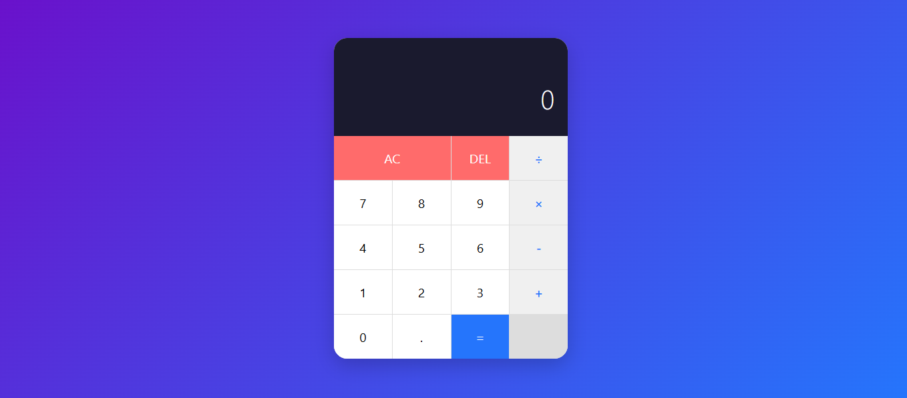

#  Simple Calculator

A clean, modern, and responsive calculator web application built with pure HTML, CSS, and JavaScript.

##  Features

- **Basic Operations**: Addition, subtraction, multiplication, division
- **Clean UI**: Modern design with gradient background and smooth animations
- **Responsive Design**: Works perfectly on desktop and mobile devices
- **Keyboard Support**: Use your keyboard for faster calculations
- **Error Handling**: Prevents division by zero and handles invalid inputs
- **Real-time Display**: Shows current and previous operations

##  Live Demo

[View Live Calculator](https://a5303.github.io/simple-calculator/)

##  Technologies Used

- **HTML5** - Semantic structure
- **CSS3** - Grid layout, Flexbox, CSS gradients, animations
- **JavaScript (ES6)** - Object-oriented programming with Classes
- **Git** - Version control
- **GitHub Pages** - Free hosting

##  Project Structure
